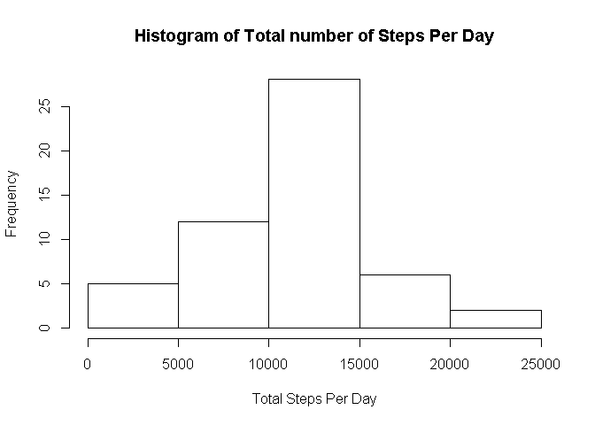

# Reproducible Research: Peer Assessment 1


## Loading and preprocessing the data
1. We load the data
2. Convert the date into correct date format
3. Mutate the weekday/weekend column with each row

```r
activity <- read.csv("./activity.csv")
library(dplyr)
```

```
## Warning: package 'dplyr' was built under R version 3.1.3
```

```
## 
## Attaching package: 'dplyr'
## 
## The following objects are masked from 'package:stats':
## 
##     filter, lag
## 
## The following objects are masked from 'package:base':
## 
##     intersect, setdiff, setequal, union
```

```r
library(lubridate)
```

```
## Warning: package 'lubridate' was built under R version 3.1.3
```

```r
activity$date <- as.Date(activity$date)
activity <- mutate(activity,isWeekend = ifelse((wday(activity$date) == 7 | wday(activity$date) == 1), "Weekend", "Weekday"))
```


## What is mean total number of steps taken per day?
1. Calculate the total number of steps taken per day
2. Plot the histogram

```r
activity_group <- group_by(activity,date)
tSteps <- summarize(activity_group,totalStepsPerDay = sum(steps),na.rm=TRUE)
hist(tSteps$totalStepsPerDay,xlab = "Total Steps Per Day", main = "Histogram of Total number of Steps Per Day")
```

 

## What is the average daily activity pattern?


## Imputing missing values


## Are there differences in activity patterns between weekdays and weekends?
