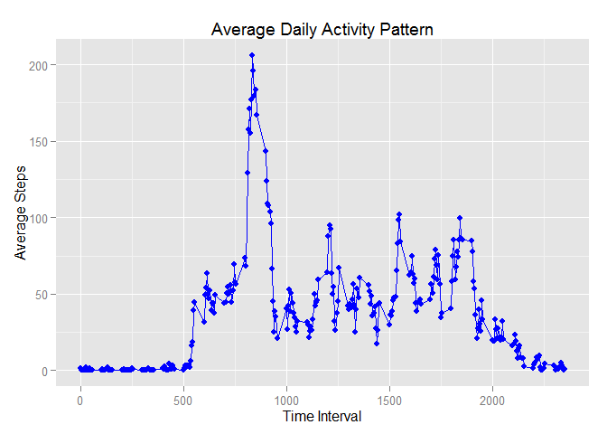

# Reproducible Research: Peer Assessment 1


## Loading and preprocessing the data
1. We load the data
2. Convert the date into correct date format
3. Mutate the weekday/weekend column with each row

```r
activity <- read.csv("./activity.csv")
library(dplyr)
```

```
## Warning: package 'dplyr' was built under R version 3.1.3
```

```
## 
## Attaching package: 'dplyr'
## 
## The following objects are masked from 'package:stats':
## 
##     filter, lag
## 
## The following objects are masked from 'package:base':
## 
##     intersect, setdiff, setequal, union
```

```r
library(lubridate)
```

```
## Warning: package 'lubridate' was built under R version 3.1.3
```

```r
activity$date <- as.Date(activity$date)
activity <- mutate(activity,isWeekend = ifelse((wday(activity$date) == 7 | wday(activity$date) == 1), "Weekend", "Weekday"))
```

  
## What is mean total number of steps taken per day?
1. Calculate the total number of steps taken per day
2. Plot the histogram
3. Calculate the mean and median of total number of steps per day

```r
tSteps <- activity %>% group_by(date) %>% summarize(totalStepsPerDay = sum(steps, na.rm = TRUE))
hist(tSteps$totalStepsPerDay,xlab = "Total Steps Per Day", main = "Histogram of Total number of Steps Per Day")
```

 

```r
tMean <- mean(tSteps$totalStepsPerDay,na.rm = TRUE)
tMedian <- median(tSteps$totalStepsPerDay, na.rm = TRUE)
tMean <- format(round(tMean,2),nsmall = 2)
```
The mean total number of steps taken per day is 9354.23 and median is 10395

  
## What is the average daily activity pattern?
1. Calculating the average of steps taken for each interval across all days and then plotting it using ggplot2.
2. Calculating the interval containing maximum average steps

```r
tInterval <- activity %>% group_by(interval) %>% summarize(averageSteps = mean(steps,na.rm=TRUE))
library(ggplot2)
```

```
## Warning: package 'ggplot2' was built under R version 3.1.3
```

```r
ggplot(tInterval,aes(interval,averageSteps)) + geom_point(col = "blue") + geom_line(col = "blue") + labs(x = "Time Interval", y = "Average Steps", title = "Average Daily Activity Pattern")
```

 

```r
maxInterval <- select(filter(tInterval,averageSteps == max(averageSteps)),interval)
maxInterval <- as.integer(maxInterval)
```
The interval 835 on average across all the days in the dataset, contains the maximum number of steps

  
## Imputing missing values


## Are there differences in activity patterns between weekdays and weekends?
